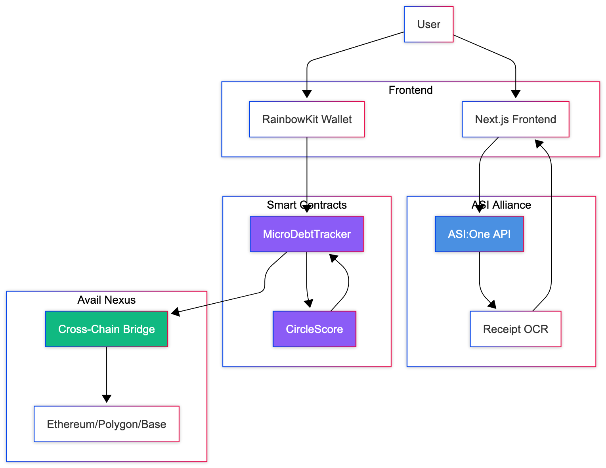
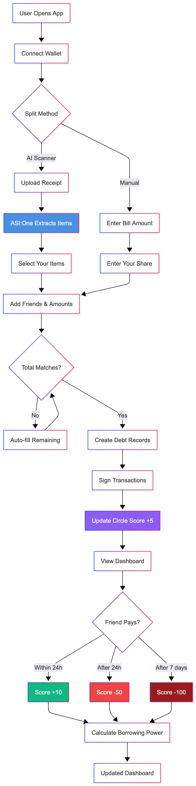
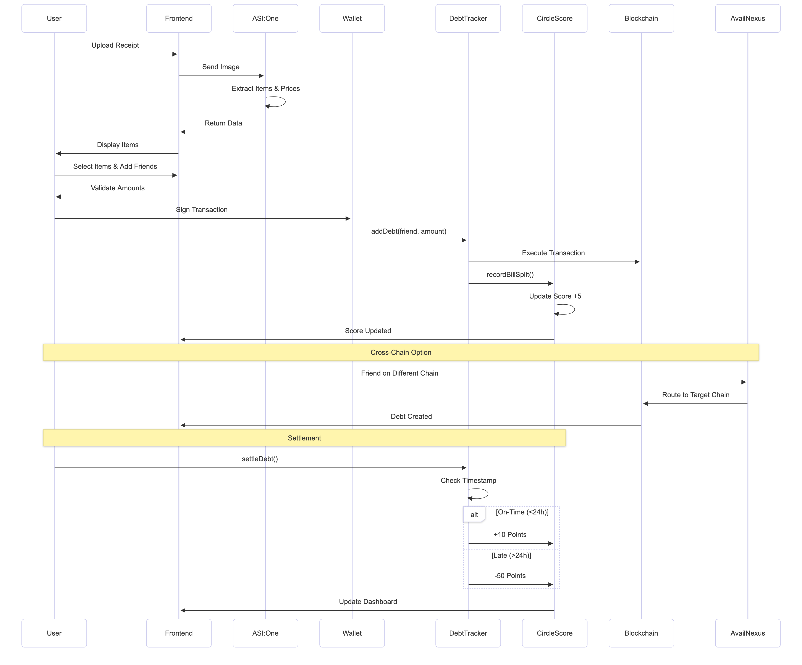

# CircleSettle 💫

**Fair bill splitting, built on trust.**

CircleSettle is a Web3-powered bill-splitting app with AI receipt scanning, voice commands, and an on-chain credit score system. Split bills fairly with friends and build your financial reputation in the process.

---

## 🌟 Key Features

### 1. AI-Powered Receipt Scanning 🤖
- **Upload any receipt** - Camera or file upload
- **Automatic extraction** - Items, prices, tax, tip
- **Multi-currency support** - USD, INR, EUR, GBP, JPY, AUD, CAD
- **Powered by ASI:One** - Advanced OCR with AI

### 2. Multi-Person Bill Splitting 👥
- **Add multiple friends** - Split with 2, 3, 4+ people
- **Custom amounts** - Manual entry for each person's share
- **Auto-fill remaining** - Automatically calculate last person's amount
- **Smart validation** - Ensures amounts add up correctly

### 3. Circle Score - On-Chain Credit 💳
- **Transparent scoring** - 300-850 range (like FICO)
- **Automatic updates** - Every action impacts your score
- **Borrowing power** - Higher score = more loan eligibility
- **Scoring rules:**
  - ✅ Split a bill: **+5 points**
  - ✅ Pay within 24 hours: **+10 points**
  - ✅ Repay a loan: **+50 points**
  - ❌ Late payment: **-50 points**

### 4. Cross-Chain Payments 🌐
- **Avail Nexus** - Cross-chain infrastructure
- **Multi-network** - Split bills across any chain
- **USDC settlements** - Stable, reliable payments

---

## 🎯 How It Works

### User Flow

```
1. Connect Wallet (RainbowKit)
   ↓
2. Choose Split Method:
   - Manual Split: Enter total bill and friends' shares
   - AI Scanner: Upload receipt photo
   ↓
3. Add Multiple Friends (4-5+ people)
   ↓
4. Enter Amount Each Friend Owes (or auto-fill remaining)
   ↓
5. Create Debt Records On-Chain
   ↓
6. Circle Score +5 (both parties)
   ↓
7. Settle Payment (within 24h = +10 pts)
   ↓
8. Build Reputation → Unlock Loans
```

---

## 📊 System Diagrams

### System Architecture


### User Flow


### Technical Sequence


---

## 🏗️ Architecture

### Tech Stack

**Frontend:**
- **Next.js 15** - React framework with App Router
- **TypeScript** - Type-safe development
- **TailwindCSS 4** - Utility-first styling
- **Wagmi** - Ethereum React hooks
- **RainbowKit** - Beautiful wallet connection
- **Lucide React** - Professional icon library

**Smart Contracts:**
- **Solidity 0.8.20** - Smart contract language
- **Foundry** - Development & testing framework
- **OpenZeppelin** - Security standards

**AI/ML:**
- **ASI:One API** - Receipt OCR (primary)

**Blockchain:**
- **Avail Nexus** - Cross-chain messaging
- **Ethereum-compatible chains** - Primary deployment
- **USDC** - Payment token

---

## 📁 Project Structure

```
circlesettle/
├── app/
│   ├── page.tsx                    # Landing page
│   ├── dashboard/page.tsx          # Main dashboard
│   ├── split-bill/page.tsx         # Manual split
│   ├── split-bill-ai/page.tsx      # AI scanner + voice
│   └── api/scan-receipt/route.ts   # OCR API endpoint
├── components/
│   ├── CircleScoreCard.tsx         # Score display
│   ├── PaymentHistoryTimeline.tsx  # Activity timeline with filters
│   ├── ScoreTrendGraph.tsx         # Score visualization
│   ├── DebtCard.tsx                # Transaction card
│   ├── Header.tsx                  # Navigation header
│   └── CrossChainBanner.tsx        # Network selector
├── contracts/
│   ├── src/
│   │   ├── CircleScore.sol         # Credit scoring
│   │   └── MicroDebtTracker.sol    # Debt tracking
│   ├── test/
│   │   └── CircleScore.t.sol       # Contract tests
│   └── script/
│       └── DeployCircleScore.s.sol # Deployment
├── lib/
│   ├── hooks/
│   │   ├── useCircleScore.ts       # Score data hook
│   │   ├── useDebts.ts             # Debt queries
│   │   └── useAddDebt.ts           # Create debt
│   └── contracts/
│       └── CircleScoreABI.ts       # Contract ABI
└── .env.example                     # Environment template
```

---

## 🚀 Getting Started

### Prerequisites

- **Node.js 18+** - JavaScript runtime
- **npm/yarn/pnpm** - Package manager
- **Foundry** - Smart contract toolchain
- **Wallet** - MetaMask or compatible

### Installation

1. **Clone the repository**
```bash
git clone https://github.com/yourusername/circlesettle.git
cd circlesettle
```

2. **Install dependencies**
```bash
npm install
```

3. **Set up environment variables**
```bash
cp .env.example .env.local
```

Edit `.env.local` with your keys:
```env
HEDERA_ACCOUNT_ID=0.0.7xxxxxx
HEDERA_PRIVATE_KEY=0x0000000000000000000000000000000000000000
NEXT_PUBLIC_HEDERA_TESTNET_RPC=https://testnet.hashio.io/api
WALLETCONNECT_PROJECT_ID=your_project_id_here
NODE_ENV="development"
NEXT_PUBLIC_USE_TESTNET=true
ASI_ONE_API_KEY=sk_40000000000000000000000000000000000000000

```

4. **Run development server**
```bash
npm run dev
```

Open [http://localhost:3000](http://localhost:3000)

---

## 📜 Smart Contract Deployment

### 1. Install Foundry
```bash
curl -L https://foundry.paradigm.xyz | bash
foundryup
```

### 2. Build Contracts
```bash
cd contracts
forge build
```

### 3. Run Tests
```bash
forge test -vv
```

### 4. Deploy to Testnet
```bash
# Set your private key in .env
echo "PRIVATE_KEY=your_private_key" >> .env

# Deploy CircleScore + MicroDebtTracker
forge script script/DeployCircleScore.s.sol \
  --rpc-url <YOUR_RPC_URL> \
  --broadcast \
  --verify
```

### 5. Update Frontend Config
Copy deployed addresses to `.env.local`:
```env
NEXT_PUBLIC_CIRCLE_SCORE_ADDRESS=0x...
NEXT_PUBLIC_DEBT_TRACKER_ADDRESS=0x...
```

---

## 🎮 Usage Guide

### 1. Connect Your Wallet
- Click "Connect Wallet" button
- Select MetaMask (or other wallet)
- Approve connection

### 2. Split a Bill with AI
- Navigate to "AI Scanner"
- Upload receipt photo
- Wait for AI to extract items
- Select the items you had
- Review your calculated share
- Add multiple friends' wallet addresses
- Enter amount each friend owes (or use auto-fill)
- Click "Create Debt Records"
- Approve transactions in wallet

### 3. View Your Circle Score
- Dashboard shows your score prominently
- Hover over stats for tooltips
- View score trend graph (always shows at least 2 points)
- Check payment history timeline with filters:
  - Filter by type (All, Bills Split, Paid, Received)
  - Search by address or amount
  - Sort by date or amount
  - Click blockchain explorer links for transaction details
- See borrowing power

### 4. Settle a Debt
- Find debt in "Your Transactions"
- Click "Settle" button
- Approve payment
- Score updates automatically:
  - Within 24 hours: **+10 points** ✅
  - After 24 hours: **-50 points** ⚠️

---

## 🧪 Testing

### Frontend Tests
```bash
npm run test
```

### Smart Contract Tests
```bash
cd contracts
forge test -vv

# Run specific test
forge test --match-test testRecordBillSplit -vvv

# Gas report
forge test --gas-report
```

### Test Coverage
```bash
forge coverage
```

---

## 🎨 Features Breakdown

### CircleScore Smart Contract

#### Core Functions
```solidity
// View functions
getScore(address user) → uint256
getScoreDetails(address user) → UserScore
calculateBorrowingPower(address user) → uint256
isEligibleForLoan(address user, uint256 amount) → bool

// State-changing functions
recordBillSplit(address user)        // +5 points
recordPayment(address user, uint256 debtTime)  // +10 or -50
recordLoanRepayment(address user)    // +50 points
```

#### Scoring Algorithm
```javascript
Initial Score: 500

Bill Split: +5
  → Total: 500 + 5 = 505

On-Time Payment (< 24h): +10
  → Total: 505 + 10 = 515

Late Payment (> 24h): -50
  → Total: 515 - 50 = 465

Loan Repaid: +50
  → Total: 465 + 50 = 515

Min: 300, Max: 850
```

#### Borrowing Power Formula
```javascript
if (score < 500) return 0
if (score >= 850) return $5,000
if (score >= 700) return $1,000 + (score - 700) * $26.67
if (score >= 500) return $200 + (score - 500) * $4.00

Example:
- Score 500 → $200
- Score 600 → $600
- Score 700 → $1,000
- Score 750 → $2,333
- Score 850 → $5,000
```

---

## 🔐 Security

### Smart Contract Security
- **Audited patterns** - OpenZeppelin standards
- **Reentrancy protection** - Checks-effects-interactions
- **Access control** - Only debtor can settle their debt
- **Integer overflow** - Solidity 0.8.20 built-in protection
- **Score bounds** - Clamped to 300-850 range

### Frontend Security
- **Environment variables** - API keys never exposed
- **Wallet signatures** - User authorization required
- **Input validation** - Form validation on all inputs
- **HTTPS only** - Secure connections enforced

---

## 🏆 Hackathon Integration

### Partner Technologies

#### 1. ASI Alliance (ASI:One)
- **Receipt OCR** - Primary scanning engine
- **High accuracy** - Item extraction with AI
- **Multi-language** - Supports international receipts
- **API Integration** - `api/scan-receipt/route.ts`

#### 2. Avail Nexus
- **Cross-chain messaging** - Multi-network support
- **USDC transfers** - Stable payment routing
- **SDK Integration** - `lib/avail-config.ts`
- **Network switching** - ChainSelector component

#### 3. Hedera (Future)
- **Fast finality** - Sub-second transactions
- **Low fees** - Cost-effective settlements
- **HCS** - Consensus service for disputes

---

## 📊 Metrics & Analytics

### Smart Contract Events
```solidity
event DebtCreated(uint256 debtId, address creditor, address debtor, uint256 amount)
event DebtSettled(uint256 debtId)
event ScoreUpdated(address user, uint256 newScore, string reason)
event BillSplitRecorded(address user, uint256 scoreIncrease)
event PaymentRecorded(address user, bool onTime, uint256 scoreChange)
```

### Track User Activity
- Total debts created
- Average settlement time
- Score distribution
- Borrowing power trends
- Payment success rate

---

## 🤝 Contributing

Contributions are welcome! Please follow these guidelines:

1. **Fork the repository**
2. **Create a feature branch** (`git checkout -b feature/AmazingFeature`)
3. **Commit your changes** (`git commit -m 'feat: add amazing feature'`)
4. **Push to the branch** (`git push origin feature/AmazingFeature`)
5. **Open a Pull Request**

### Commit Convention
- `feat:` - New feature
- `fix:` - Bug fix
- `refactor:` - Code refactoring
- `ui:` - UI/UX changes
- `test:` - Adding tests
- `chore:` - Maintenance tasks

---

## 📝 License

This project is licensed under the **MIT License** - see the [LICENSE](LICENSE) file for details.

---

## 👨‍💻 Author

**Basant Singh**

Built for ETH Online 2025 with ❤️

---

## 🙏 Acknowledgments

- **ASI Alliance** - AI-powered receipt scanning
- **Avail Project** - Cross-chain infrastructure
- **OpenZeppelin** - Secure smart contract libraries
- **Wagmi Team** - Excellent React hooks
- **RainbowKit** - Beautiful wallet UX

---

## 📞 Support

- **Issues:** [GitHub Issues](https://github.com/basantsd/circlesettle/issues)
- **Linkedin:** [@basantsd](https://www.linkedin.com/in/basantsd/)
- **Email:** sbasant12345@gmail.com

---

## ⚠️ Disclaimer

CircleSettle is a hackathon project and currently in beta. Smart contracts have not been professionally audited. Use at your own risk. Do not use with significant amounts of cryptocurrency on mainnet.

---

<div align="center">

**[Website](https://circlesettle.com)** • **[Demo Video](https://youtube.com/watch?v=...)**

Made with 💫 for the future of trust-based finance

</div>
